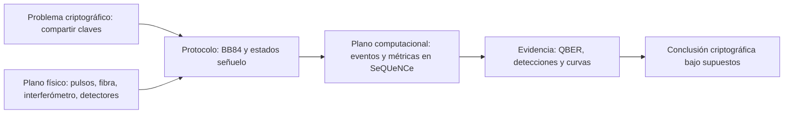

# Orientación y diagnóstico inicial

## Propósito

Este diagnóstico no se califica con una nota global. Queremos encontrar cuatro
perfiles independientes: criptografía, matemática, óptica y simulación. Respondé sin
buscar. Escribí `no sé` cuando corresponda; inventar una respuesta oculta el punto que
necesitamos estudiar.

## Mapa mental de la tesis

- El **plano físico** pregunta qué se prepara, qué se pierde y qué detecta Bob.
- El **plano protocolar** pregunta qué decisiones toman Alice y Bob.
- El **plano computacional** pregunta cómo representamos esos eventos.
- El **plano criptográfico** pregunta qué secreto puede extraerse bajo qué supuestos.

Confundir planos produce afirmaciones peligrosas. Una simulación puede calcular un
QBER; no certifica por sí sola que un dispositivo real sea seguro.

## A. Criptografía: cinco preguntas

1. ¿Cuál es la diferencia entre cifrar un mensaje y autenticarlo?
2. Si Alice y Bob ya comparten una clave secreta, ¿qué problema resuelve un cifrado
   simétrico?
3. ¿Por qué el *one-time pad* necesita una clave tan larga como el mensaje?
4. ¿Qué información puede viajar públicamente durante una negociación de claves sin
   que la clave final sea pública?
5. ¿QKD cifra los datos de una videollamada? Explicá qué entrega realmente.

## B. Probabilidad y álgebra lineal: cinco preguntas

6. Una moneda justa se lanza cuatro veces. ¿Cuál es la probabilidad de obtener
   exactamente dos caras?
7. Normalizá el vector `(3, 4)` y explicá qué significa normalizar.
8. Calculá el producto interno entre `(1, 0)` y `(1/sqrt(2), 1/sqrt(2))`.
9. Si un evento ocurre con probabilidad `0,01` en cada ensayo independiente, ¿cuál es
   el número esperado de eventos en 10.000 ensayos?
10. Explicá con tus palabras la diferencia entre una probabilidad condicional
    `P(A|B)` y una probabilidad conjunta `P(A y B)`.

## C. Fibra y óptica: cinco preguntas

11. ¿Qué significa que una fibra tenga atenuación expresada en dB/km?
12. Si una potencia cae a la mitad, ¿la pérdida se suma o se multiplica cuando
    agregamos otro tramo idéntico? Justificá.
13. ¿Qué diferencia imaginás entre potencia óptica continua y detectar fotones
    individuales?
14. ¿Qué puede producir un click en un detector aunque no llegue un fotón de señal?
15. ¿Qué dos caminos deben existir para observar interferencia?

## D. Python y simulación: cinco preguntas

16. ¿Qué diferencia hay entre una función, una clase y una instancia en Python?
17. ¿Qué resultado esperás de `10 ** (-6 / 10)` y por qué podría aparecer en un
    cálculo de telecomunicaciones?
18. ¿Qué ventaja tiene fijar una semilla aleatoria al comparar dos simulaciones?
19. Si cambiás simultáneamente distancia y eficiencia del detector, ¿por qué cuesta
    atribuir el resultado a una causa?
20. ¿Qué diferencia hay entre una fórmula analítica y una simulación de eventos
    discretos?

## Pregunta oral de dos minutos

Sin leer la tesis, respondé: **¿qué problema intenta resolver este trabajo, qué método
usa y qué evidencia produce?**

No busques precisión perfecta. Grabá o escribí la respuesta inicial para compararla
con la de las semanas 4 y 8.

## Rúbrica por categoría

Evaluá cada bloque por separado:

| Estado | Evidencia |
|---|---|
| Rojo | 0-1 respuestas defendibles o conceptos básicos mezclados |
| Amarillo | 2-3 respuestas correctas, pero sin justificar o transferir |
| Verde | 4 respuestas correctas y justificadas sin ayuda |
| Azul | 5 respuestas correctas, justificadas y conectadas con la tesis |

Una respuesta es defendible cuando incluye el mecanismo, no solo la palabra correcta.
Registrá el color de cada categoría en [progreso](../progreso.md). Toda respuesta que
parecía convincente pero falló debe ir a [errores y dudas](../errores_y_dudas.md).

## Primer cierre

Terminá con cuatro frases:

1. Mi base más fuerte hoy es...
2. Mi hueco más importante es...
3. La pregunta que más me sorprendió fue...
4. En la defensa quiero poder explicar...
