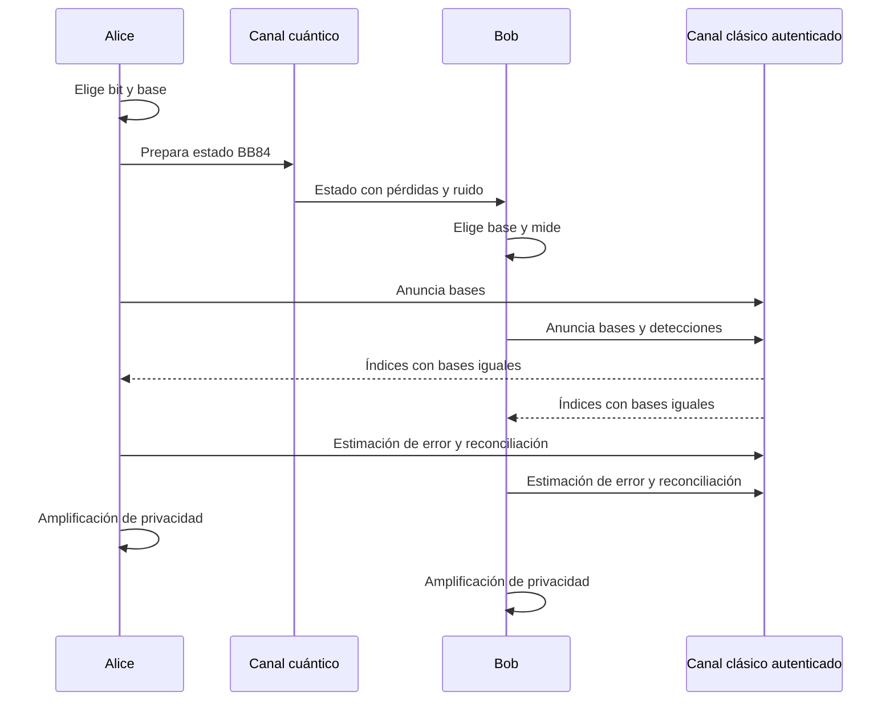

# Semana 2: fundamentos cuánticos y BB84

## Objetivos

Al terminar deberías poder representar los cuatro estados de BB84 como vectores,
calcular probabilidades de medición con productos internos, ejecutar el protocolo
sobre una tabla y derivar el 25% de QBER del ataque intercept-resend ideal.

## 1. De un bit a un qubit

Un bit clásico toma un valor definido, `0` o `1`. Un qubit ideal es un vector unitario
en un espacio complejo de dimensión dos:

```math
|\psi\rangle=\alpha|0\rangle+\beta|1\rangle,
\qquad |\alpha|^2+|\beta|^2=1.
```

En la base computacional:

```math
|0\rangle=\begin{pmatrix}1\\0\end{pmatrix},
\qquad
|1\rangle=\begin{pmatrix}0\\1\end{pmatrix}.
```

`alpha` y `beta` son amplitudes complejas, no probabilidades. Sus módulos al cuadrado
producen probabilidades al medir en esa base.

Un qubit no significa que el sistema "tiene secretamente 0 y 1 al mismo tiempo" como
dos bits clásicos ocultos. La superposición describe amplitudes que pueden interferir
y cuyos resultados dependen de la base de medición.

## 2. Vectores, bases y normalización

Una base ortonormal contiene vectores de norma uno y mutuamente ortogonales. Además
de la base `Z = {|0>, |1>}`, BB84 usa la base diagonal `X`:

```math
|+\rangle=\frac{|0\rangle+|1\rangle}{\sqrt{2}}
=\frac{1}{\sqrt{2}}\begin{pmatrix}1\\1\end{pmatrix},
```

```math
|-\rangle=\frac{|0\rangle-|1\rangle}{\sqrt{2}}
=\frac{1}{\sqrt{2}}\begin{pmatrix}1\\-1\end{pmatrix}.
```

Comprobación:

```math
\langle+|+\rangle=\frac{1}{2}(1^2+1^2)=1,
\qquad
\langle+|-\rangle=\frac{1}{2}(1-1)=0.
```

Dentro de una base, los estados son perfectamente distinguibles. Entre bases, no lo
son: `|<0|+>|^2 = 1/2`.

## 3. Medición y regla de Born

Si medimos `|psi>` en una base con vectores `|b_i>`, la probabilidad del resultado
`i` es:

```math
P(i)=|\langle b_i|\psi\rangle|^2.
```

### Misma base

Si Alice prepara `|0>` y Bob mide en Z:

```math
P(0)=|\langle0|0\rangle|^2=1,
\qquad P(1)=0.
```

### Base incompatible

Si Bob mide ese mismo `|0>` en X:

```math
P(+)=|\langle+|0\rangle|^2=\frac12,
\qquad P(-)=\frac12.
```

El resultado no revela si Alice había preparado `|0>` o `|1>` con certeza. Después
de la medición ideal, el estado queda asociado al resultado de la base usada; por eso
una medición incompatible altera lo que recibirá un observador posterior.

## 4. Estados no ortogonales y no clonación

Los estados de BB84 no son cuatro alternativas mutuamente ortogonales. Por ejemplo,
`|0>` y `|+>` tienen producto interno `1/sqrt(2)`. No existe una medición que los
distinga siempre sin error.

El teorema de no clonación afirma que no existe una operación física universal que
copie perfectamente un estado cuántico desconocido arbitrario. Una demostración
breve usa preservación de productos internos. Si una operación unitaria `U` clonara
dos estados:

```math
U|\psi\rangle|s\rangle=|\psi\rangle|\psi\rangle,
\qquad
U|\phi\rangle|s\rangle=|\phi\rangle|\phi\rangle,
```

entonces el producto interno antes y después exigiría:

```math
\langle\psi|\phi\rangle=(\langle\psi|\phi\rangle)^2.
```

Esto solo vale, en general, si el producto es 0 o 1: estados ortogonales o idénticos.
No vale para estados distintos y no ortogonales como `|0>` y `|+>`.

**Lo que no demuestra:** no clonación no prueba por sí sola seguridad de un sistema
QKD real. Faltan el protocolo completo, el modelo de Eve, estimación estadística,
posprocesamiento y control de imperfecciones.

## 5. BB84 paso a paso

La codificación ideal usada en este capítulo es:

| Base | Bit 0 | Bit 1 |
|---|---|---|
| Z | `|0>` | `|1>` |
| X | `|+>` | `|->` |

El protocolo:

1. Alice elige aleatoriamente un bit y una base.
2. Prepara uno de los cuatro estados y lo envía.
3. Bob elige aleatoriamente una base y mide.
4. Por el canal clásico autenticado, anuncian bases, no bits.
5. Conservan posiciones con bases iguales: **tamizado** o *sifting*.
6. Revelan una muestra para estimar QBER.
7. Si los parámetros son aceptables, reconcilian y amplifican privacidad.



El canal clásico es público pero autenticado. Los bits de la clave no se publican en
su totalidad; una muestra puede revelarse para estimar errores y se descarta.

## 6. Ejemplo completo con 12 posiciones

Supongamos canal ideal y ausencia de Eve. `R` marca un resultado aleatorio porque Bob
usó otra base.

| i | Bit A | Base A | Estado | Base B | Resultado B | ¿Guardar? |
|---:|---:|---|---|---|---:|---|
| 1 | 0 | Z | `|0>` | Z | 0 | Sí |
| 2 | 1 | X | `|->` | Z | 0 (R) | No |
| 3 | 1 | Z | `|1>` | Z | 1 | Sí |
| 4 | 0 | X | `|+>` | X | 0 | Sí |
| 5 | 1 | X | `|->` | X | 1 | Sí |
| 6 | 0 | Z | `|0>` | X | 1 (R) | No |
| 7 | 0 | Z | `|0>` | Z | 0 | Sí |
| 8 | 1 | X | `|->` | X | 1 | Sí |
| 9 | 0 | Z | `|0>` | X | 1 (R) | No |
| 10 | 1 | X | `|->` | Z | 0 (R) | No |
| 11 | 1 | Z | `|1>` | Z | 1 | Sí |
| 12 | 0 | X | `|+>` | X | 0 | Sí |

Clave tamizada de Alice: `01010110`. Clave tamizada de Bob: `01010110`. En este
ejemplo coincidieron ocho bases; para elecciones uniformes, el promedio de
coincidencia tiende a 1/2, no necesariamente exactamente 1/2 en una muestra corta.

## 7. Ataque intercept-resend

Eve mide cada estado en una base aleatoria y prepara un nuevo estado según su
resultado.

Nos interesan posiciones donde Alice y Bob usaron la misma base, porque esas forman
la clave tamizada:

- Eve acierta la base con probabilidad `1/2`: no introduce error ideal.
- Eve elige la base equivocada con probabilidad `1/2`.
- En ese caso, su resultado pierde la preparación original; cuando Bob mide en la
  base correcta de Alice, difiere con probabilidad `1/2`.

Por tanto:

```math
QBER_{IR}=\frac12\times\frac12=\frac14=25\%.
```

Esto es una firma del ataque idealizado, no una regla que diga que todo QBER de 25%
prueba intercept-resend ni que un QBER menor descarta ataques más sofisticados.

## 8. Conexión con la tesis

La tesis implementa BB84 usando pulsos ópticos y codificación time-bin, no qubits
abstractos almacenados en una computadora cuántica. Las bases se traducen en tiempo
de llegada y fase relativa, y las mediciones dependen de detectores e interferencia.

El modelo simula transmisión, medición y tamizado. Después usa QBER y throughput para
estimar tasas. Por eso esta semana fija la lógica del protocolo; las semanas 3 y 4
traducen esa lógica a seguridad cuantitativa y hardware.

Revisá las secciones BB84 del [marco teórico de la tesis](../../paper/chapters/02_marco_teorico.tex).

## 9. Límites de las analogías

- Una moneda explica aleatoriedad, pero no amplitudes ni interferencia.
- Elegir anteojos de colores puede representar bases, pero no demuestra no clonación.
- Decir que "mirar cambia el objeto" es insuficiente: muchas mediciones clásicas
  también perturban; lo relevante es la estructura de estados no ortogonales y el
  modelo cuántico.
- El protocolo ideal no contiene pérdidas, pulsos multifotónicos, dark counts ni
  canales laterales.

## 10. Preguntas de tribunal

### ¿Por qué Alice y Bob anuncian las bases sin revelar la clave?

Porque la base identifica cómo se preparó o midió, no el resultado bit completo. Las
posiciones compatibles se conservan; la seguridad se evalúa descontando toda la
información publicada y una muestra revelada.

**Repregunta:** ¿Eve no aprende algo al escuchar las bases?

Sí, aprende información pública del transcript. La prueba y la amplificación de
privacidad deben contemplarla; publicar bases no equivale a publicar todos los bits.

### ¿No clonación impide que Eve ataque?

Impide una estrategia universal de copiar estados desconocidos perfectamente y dejar
el original intacto. Eve todavía puede medir, bloquear, reemplazar, explotar pérdidas
o atacar dispositivos. La seguridad se demuestra contra un modelo de capacidades,
no con una sola frase.

### ¿Por qué descartar mediciones en bases distintas si contienen resultados?

Porque esos resultados son aleatorios respecto del bit de Alice en el modelo ideal.
Conservarlos aumentaría el error y no produciría correlación útil para la clave.

## 11. Salida oral de dos minutos

Explicá BB84 dos veces:

1. Sin ecuaciones, usando preparación, bases, medición, anuncio y tamizado.
2. Con los cuatro vectores, la regla de Born y el cálculo del 25% de intercept-resend.

Si una versión contradice a la otra, el tema sigue amarillo.

## 12. Fuentes

- C. H. Bennett y G. Brassard, [Quantum cryptography: Public key distribution and coin tossing](https://doi.org/10.1016/j.tcs.2014.05.025).
- W. K. Wootters y W. H. Zurek, [A single quantum cannot be cloned](https://doi.org/10.1038/299802a0).
- P. W. Shor y J. Preskill, [Simple proof of security of the BB84 quantum key distribution protocol](https://doi.org/10.1103/PhysRevLett.85.441).
- [Marco teórico de la tesis](../../paper/chapters/02_marco_teorico.tex).

## Próximo paso

Resolvé los [ejercicios de la semana 2](../ejercicios/semana_02.md) y completá el
primer punto de control del [plan maestro](../plan_maestro.md).
