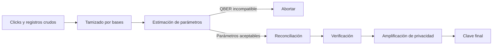

# Semana 3: seguridad, QBER y tasa de llave secreta

## Objetivos

Esta semana convierte "Eve introduce perturbaciones" en una cadena cuantitativa.
Deberías poder distinguir clave cruda, tamizada, reconciliada y final; calcular QBER,
entropía binaria y la cota simple de la tesis; y explicar por qué una curva positiva
no equivale a certificar un sistema.

## 1. De clicks a clave final

Un click de Bob no es todavía un bit secreto. El flujo completo es:



- **Datos crudos:** elecciones y detecciones antes de comparar bases.
- **Clave tamizada:** posiciones detectadas donde las bases son compatibles.
- **Clave reconciliada:** cadenas corregidas para que Alice y Bob coincidan.
- **Clave final:** salida comprimida después de descontar información potencial de
  Eve y fuga del transcript clásico.

La tesis simula con detalle las primeras etapas y estima la tasa final con fórmulas.
No ejecuta reconciliación y privacidad como protocolos completos.

## 2. QBER

```math
Q=QBER=\frac{N_{errores}}{N_{bits\;tamizados}}.
```

Si Alice y Bob comparan 800 bits relevantes y encuentran 48 diferencias:

```math
Q=\frac{48}{800}=0{,}06=6\%.
```

En una ejecución real no suelen revelar toda la clave: toman una muestra para estimar
el error del conjunto restante con un nivel de confianza. Los bits revelados se
descartan.

QBER mezcla causas posibles:

- desalineación o error de preparación;
- baja visibilidad interferométrica;
- ventanas temporales mal ubicadas;
- dark counts y luz de fondo;
- afterpulsing o saturación;
- intervención de Eve.

Alice y Bob no necesitan atribuir la causa para actuar conservadoramente. Si los datos
no permiten una cota positiva, abortan. Pero un ingeniero sí quiere separar causas
para mejorar el enlace.

## 3. Reconciliación y fuga

Alice y Bob poseen cadenas parecidas, no idénticas. Un protocolo de reconciliación
publica información auxiliar, por ejemplo paridades, para localizar y corregir errores.
Eve escucha ese transcript.

El costo ideal mínimo está relacionado con la entropía binaria. En la práctica aparece
un factor de ineficiencia `f_EC >= 1`. Si `f_EC=1`, la reconciliación alcanza el límite
ideal del modelo; `f_EC=1,16` significa aproximadamente 16% más fuga que ese límite.

**Importante:** corregir errores no elimina la información de Eve. Hace iguales las
cadenas de Alice y Bob, a costa de publicar información que después debe descontarse.

## 4. Entropía binaria

```math
h_2(x)=-x\log_2x-(1-x)\log_2(1-x).
```

Por continuidad, `h_2(0)=h_2(1)=0`. En `x=1/2`, `h_2=1`: la incertidumbre binaria es
máxima.

Para `Q=0,06`:

```math
h_2(0{,}06)\approx0{,}3274.
```

La función no es "el porcentaje de bits que conoce Eve". Es una cantidad de
información que aparece dentro de cotas bajo supuestos concretos.

## 5. Amplificación de privacidad

Alice y Bob aplican una familia de hashes universales para comprimir la clave
reconciliada. La salida es más corta. La idea es que, aunque Eve tenga información
parcial sobre la entrada, su información sobre la salida sea despreciable dentro del
parámetro de seguridad elegido.

La compresión no crea secreto de la nada. Su longitud permitida depende de la
estimación de parámetros, la fuga de reconciliación, el modelo de fuentes y detectores
y las correcciones de tamaño finito.

## 6. Cota simple usada en la tesis

El script usa una expresión tipo Shor-Preskill:

```math
R_{simple}=R_{tamizada}\max\left[0,1-f_{EC}h_2(Q)-h_2(Q)\right].
```

| Símbolo | Significado | Unidad |
|---|---|---|
| `R_simple` | tasa secreta estimada | bit/s |
| `R_tamizada` | throughput después del tamizado | bit/s |
| `Q` | QBER como fracción | sin unidad |
| `f_EC` | ineficiencia de reconciliación | sin unidad |
| `h_2` | entropía binaria | bit por bit binario |

Ejemplo con `R_tamizada=10.000 bit/s`, `Q=0,06` y `f_EC=1,16`:

```math
F=1-1{,}16(0{,}3274)-0{,}3274\approx0{,}2928,
```

```math
R_{simple}\approx10\,000\times0{,}2928=2\,928\;bit/s.
```

El factor `F` representa la fracción que queda dentro de esta cota. No es eficiencia
óptica ni probabilidad de detección.

## 7. El umbral cercano a 11%

Para BB84 ideal con procesamiento unidireccional y supuestos estándar suele citarse
una referencia cercana a 11%. En el código de la tesis, un `QBER >= 0,11` devuelve
cero explícitamente. Además, la expresión incluye `f_EC=1,16` y el operador `max(0,...)`;
por esa ineficiencia, el factor puede hacerse cero antes del 11%.

Por lo tanto, una defensa rigurosa no dice "debajo de 11% siempre hay clave". Dice:

> El trabajo usa aproximadamente 11% como referencia y anula la cota en ese punto,
> pero la positividad efectiva depende de la fórmula, `f_EC` y los demás supuestos.

## 8. Cuatro niveles de afirmación

| Afirmación | Qué evidencia aporta | Qué no demuestra |
|---|---|---|
| QBER observado bajo | Alice y Bob tienen buena correlación | Que Eve tenga información nula |
| Cota analítica positiva | El modelo permite una longitud secreta positiva | Que el modelo represente todo el hardware |
| Prueba de seguridad bajo supuestos | Cubre ataques dentro del modelo formal | Ausencia de canales laterales fuera del modelo |
| Implementación evaluada/certificada | Dispositivos y procesos fueron ensayados según criterios | Seguridad absoluta para cualquier entorno futuro |

La tesis llega al segundo nivel para fines de diseño. Usa teoría del tercero como
fundamento, pero no produce una nueva prueba ni una certificación del cuarto.

## 9. Seguridad asintótica y tamaño finito

Una expresión asintótica imagina una cantidad muy grande de señales, de modo que las
frecuencias observadas aproximan probabilidades. En experimentos finitos hay
fluctuaciones estadísticas. Una tasa composable de tamaño finito debe reservar margen
para estimación, corrección, verificación y parámetros de fallo.

Las curvas de la tesis son útiles para sensibilidad y factibilidad. No deben
presentarse como tasas comerciales garantizadas de una sesión corta.

## 10. Conexión con el código y la tesis

En [`secret_key_rate_bb84_simple`](../../experiments/qkd_2node_simulation.py), el
programa:

1. rechaza QBER no finito o mayor o igual que 0,11;
2. calcula entropía binaria;
3. limita el factor inferior a cero;
4. multiplica por throughput tamizado.

La explicación formal aparece en el [marco teórico](../../paper/chapters/02_marco_teorico.tex)
y las limitaciones en [discusión y validez](../../paper/chapters/09_discusion_validez.tex).

## 11. Errores frecuentes

- Confundir QBER con probabilidad de detección.
- Dividir errores por pulsos enviados en vez de bits tamizados relevantes.
- Decir que reconciliación vuelve secreta la clave.
- Ignorar la información publicada durante corrección.
- Interpretar una cota negativa como tasa física negativa; se recorta a cero.
- Tratar 11% como certificado universal.
- Presentar una fórmula asintótica como ejecución completa del posprocesamiento.

## 12. Preguntas de tribunal

### ¿Un QBER de 2% demuestra que no estaba Eve?

No. Demuestra buena correlación dentro de los datos observados. La información de Eve
se acota mediante una prueba y un modelo; además, algunos ataques explotan
imperfecciones sin aparecer como el intercept-resend ideal.

**Repregunta:** entonces, ¿para qué sirve QBER? Para estimar parámetros, decidir si se
aborta y alimentar la cota de clave; también es una métrica de diagnóstico.

### ¿Por qué reconciliación filtra información si solo se publican paridades?

Una paridad restringe el conjunto de cadenas posibles. Cada mensaje público
correlacionado con la clave puede reducir la incertidumbre de Eve y debe contabilizarse.

### ¿Qué significa que la SKR de la tesis sea una cota?

Que no es una medición directa de una clave final ejecutada. Es un límite inferior
dentro de la expresión y supuestos adoptados, construido con throughput y QBER del
modelo.

## 13. Salida oral de dos minutos

Partí de un click de Bob y terminá en una clave final. Nombrá tamizado, estimación,
reconciliación, fuga, privacidad y aborto. Después explicá qué partes ejecuta la
simulación y cuáles resume la fórmula.

## 14. Fuentes

- P. W. Shor y J. Preskill, [Simple proof of security of the BB84 quantum key distribution protocol](https://doi.org/10.1103/PhysRevLett.85.441).
- G. Brassard y L. Salvail, [Secret-key reconciliation by public discussion](https://doi.org/10.1007/3-540-48285-7_35).
- R. Renner, [Security of Quantum Key Distribution](https://arxiv.org/abs/quant-ph/0512258).
- [Marco teórico de la tesis](../../paper/chapters/02_marco_teorico.tex).

## Próximo paso

Resolvé los [ejercicios de la semana 3](../ejercicios/semana_03.md) y registrá por
separado si fallaste en calcular o en interpretar.
