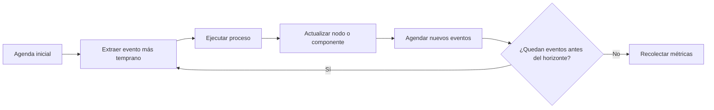
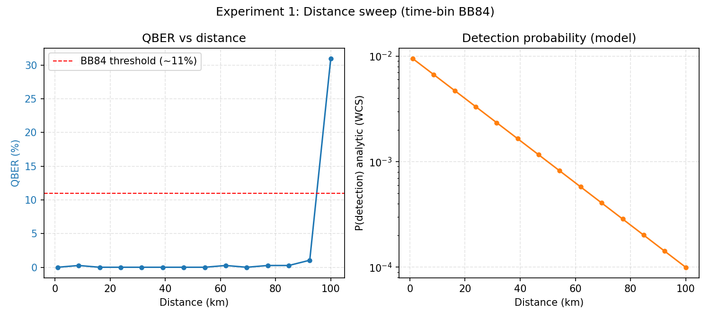
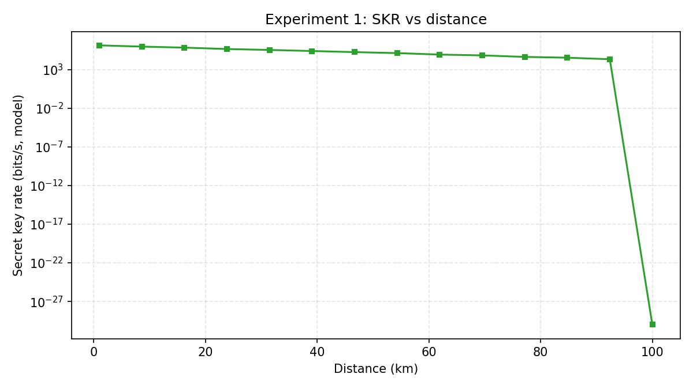
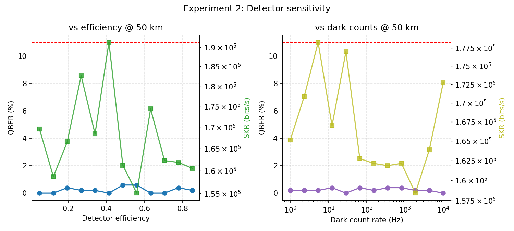
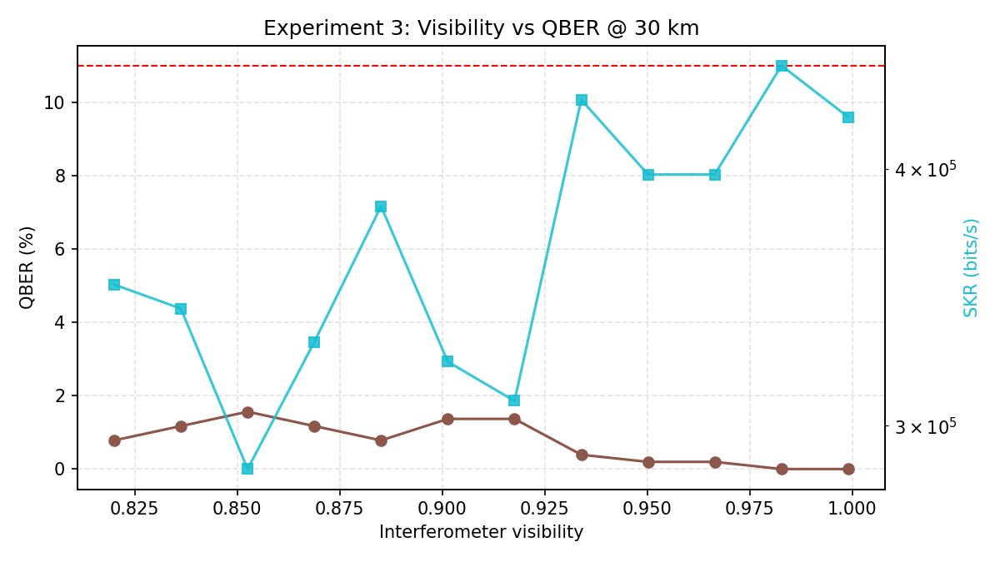
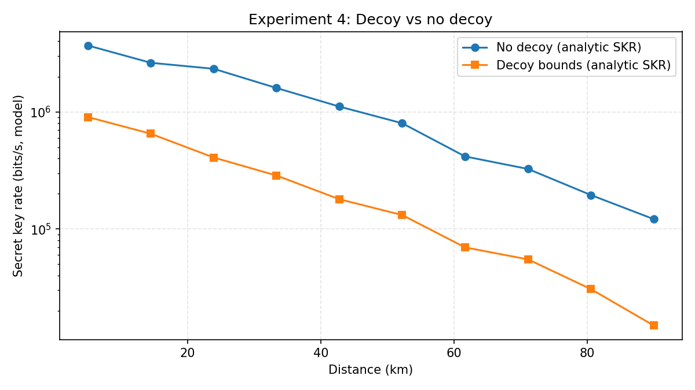

# Semana 6: SeQUeNCe, metodología y resultados

## Objetivos

Al terminar deberías poder narrar una corrida como una secuencia de eventos, ubicar
cada parámetro en el código, predecir el signo de los cuatro barridos y separar con
precisión valores simulados, fórmulas auxiliares y conclusiones de ingeniería.

## 1. Por qué simular antes de construir

Un banco QKD combina pérdidas, eventos aleatorios, detectores, temporización,
protocolos y posprocesamiento. Simular permite cambiar una variable manteniendo las
demás, repetir con semillas y descubrir qué especificación domina antes de comprar.

La simulación no reemplaza medición ni prueba formal. Responde preguntas
condicionales: **si** el modelo y los parámetros representan el sistema, **entonces**
estas tendencias son esperables.

## 2. Simulación de eventos discretos

SeQUeNCe mantiene una `Timeline` ordenada por tiempo. Cada evento tiene un instante y
un proceso. Al ejecutarse puede modificar componentes y agendar eventos posteriores.



No se calcula cada picosegundo vacío. Se salta entre emisiones, llegadas, clicks y
mensajes relevantes.

## 3. Objetos del escenario

| Objeto | Papel físico/protocolar |
|---|---|
| `Timeline` | reloj y agenda global |
| `QKDNode alice` | fuente, estado y protocolo emisor |
| `QKDNode bob` | receptor, detectores y protocolo |
| `QuantumChannel qc0/qc1` | pérdida, retardo y transporte cuántico |
| `ClassicalChannel cc0/cc1` | mensajes de protocolo |
| `BB84` | generación, medición, tamizado y métricas disponibles |
| `Process/Event` | llamada futura agendada |

Se crean canales en ambos sentidos porque la infraestructura de SeQUeNCe conecta
componentes dirigidos. El protocolo principal de clave se inicia desde Alice.

## 4. Parámetros de una corrida

`SimulationParams` reúne:

- distancia y atenuación;
- eficiencia y dark count;
- `mu` y frecuencia de fuente;
- visibilidad;
- longitud y cantidad de claves objetivo;
- horizonte de simulación;
- semillas;
- count rate y resolución temporal.

Cambiar una variable por barrido permite atribución causal aproximada. Cambiar cinco
a la vez puede mejorar una curva sin revelar qué componente fue responsable.

## 5. Recorrido de `run_single_simulation`

1. Convierte km a m y dB/km a dB/m.
2. Calcula transmitancia analítica del canal.
3. Crea timeline y canales.
4. Crea Alice y Bob con codificación `time_bin`.
5. Fija semillas, fuente y detectores.
6. Convierte visibilidad a `phase_error=(1-V)/2`.
7. Conecta extremos y empareja protocolos BB84.
8. Agenda `push` para generar claves.
9. Ejecuta la timeline.
10. Extrae QBER, throughput, cantidad de claves y fotones emitidos.
11. Calcula en paralelo una probabilidad analítica de detección WCS.

El diccionario retornado mezcla deliberadamente métricas simuladas y una referencia
analítica. Hay que etiquetarlas al graficar y defender.

## 6. Experimento 1: distancia

Barre 14 distancias entre 1 y 100 km. Predicción:

```math
\eta_{ch}=10^{-\alpha L/10}
```

cae exponencialmente en escala lineal. Disminuyen detecciones y throughput. Cuando la
señal se aproxima al piso de ruido, clicks aleatorios pesan más en QBER y la cota SKR
colapsa.





La última distancia del barrido bajo un umbral no es un alcance certificado: depende
de la grilla, semillas, horizonte, hardware modelado y cota.

## 7. Experimento 2: detector

En 50 km se barren eficiencia y dark counts. Predicciones:

- mayor eficiencia aumenta clicks de señal y, normalmente, tasa;
- dark counts agregan clicks no correlacionados;
- el impacto de dark counts crece cuando la señal llega debilitada;
- eficiencia alta no corrige mala visibilidad.



El barrido es de sensibilidad, no una comparación completa entre modelos comerciales.

## 8. Experimento 3: visibilidad

En 30 km se barre `V` y se mapea a error de fase. La relación del modelo predice un
crecimiento aproximadamente lineal de esa contribución al error al bajar V.



Este experimento fue posible después de corregir el manejo de `phase_error` para
`FreeQuantumState` en el interferómetro. Debe distinguirse una corrección de software
de un resultado físico medido.

## 9. Experimento 4: impacto decoy

Compara la cota simple con una cota decoy asintótica:



Se ejecutan corridas con intensidades signal/decoy para obtener QBER/throughput, pero
las ganancias WCS y cotas `Y1/e1` se calculan analíticamente. La figura no proviene de
un protocolo decoy completo dentro de SeQUeNCe.

## 10. Tres clases de cantidades

| Clase | Ejemplos | Cómo presentarla |
|---|---|---|
| Simulada por eventos | QBER y throughput de BB84 | Resultado del modelo SeQUeNCe |
| Analítica auxiliar | transmitancia y `P_det` | Control de tendencia/cálculo |
| Analítica de seguridad | SKR simple y decoy | Cota bajo supuestos |

Una figura puede combinar las tres. La defensa debe nombrar el origen de cada eje y
curva.

## 11. Reproducibilidad y variabilidad

Semillas fijas permiten repetir una corrida, pero no prueban robustez. Para estudiar
variabilidad hay que ejecutar semillas independientes, informar dispersión e incluir
intervalos. Una muestra sin claves devuelve QBER no finito y throughput cero; no debe
convertirse silenciosamente en un dato favorable.

El horizonte de 5 segundos simulados, claves de 128 bits y cinco claves objetivo son
decisiones de costo computacional. La frecuencia se fija en 80 MHz para mantener
tiempo de ejecución razonable.

## 12. Qué valida y qué no

### Valida dentro del modelo

- cableado lógico de dos nodos;
- respuesta de tendencias a parámetros;
- generación reproducible de figuras;
- consistencia aproximada con fórmulas de pérdida/detección.

### No valida

- hojas de datos reales bajo condiciones del campus;
- estabilidad térmica y sincronización completa;
- canales laterales y calibración;
- posprocesamiento productivo;
- seguridad composable finita del banco.

## 13. Preguntas de tribunal

### ¿Por qué usar eventos discretos en vez de una sola fórmula?

Porque el sistema tiene secuencias, estados de componentes, retardos, clicks y
mensajes. Las fórmulas siguen siendo controles útiles; la simulación integra el flujo
protocolar y permite extender hardware/topología.

### ¿Una curva suave demuestra suficientes corridas?

No. Puede provenir de promedio, grilla o fórmula. Hay que informar semillas,
dispersión, cantidad de claves y tratamiento de corridas sin datos.

### ¿Qué resultado es más importante?

No hay uno aislado. El aporte es la relación causal: pérdida reduce señal, detector y
visibilidad condicionan QBER/throughput, y las cotas traducen esas métricas a una
decisión de factibilidad bajo supuestos.

## 14. Salida oral de dos minutos

Elegí una figura. Explicá: variable barrida, parámetros fijos, mecanismo físico,
objetos de código, curva observada, fórmula de control y conclusión que no está
permitida.

## 15. Fuentes

- [Código de los cuatro experimentos](../../experiments/qkd_2node_simulation.py).
- [Herramientas y modelo](../../paper/chapters/03_herramientas_modelo.tex).
- [Metodología](../../paper/chapters/04_metodologia.tex).
- [Resultados](../../paper/chapters/05_resultados.tex).
- X. Wu et al., [SeQUeNCe: a customizable discrete-event simulator of quantum networks](https://doi.org/10.1088/2058-9565/ac22f6).

## Próximo paso

Seguí los [laboratorios](../laboratorio/README.md) y resolvé los
[ejercicios de la semana 6](../ejercicios/semana_06.md).
