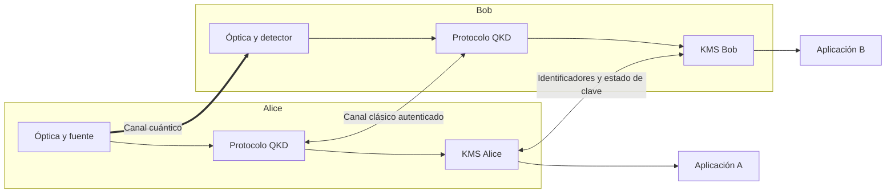

# Semana 7: red, hardware y validez

## Objetivos

Al terminar deberías poder dibujar la arquitectura de campus, separar canal cuántico,
canal clásico y entrega de claves, explicar confianza en nodos intermedios, convertir
un relevamiento en presupuesto de enlace y defender cada conclusión con su evidencia
y limitación.

## 1. Del protocolo a un servicio

Una aplicación no quiere recibir clicks ni bases; quiere material de clave con
identidad, estado, política y disponibilidad. Entre el banco óptico y la aplicación
aparecen control, posprocesamiento y un KMS.



El canal cuántico transporta estados débiles. El clásico coordina y autentica. El KMS
no genera seguridad cuántica: administra la clave resultante y la entrega de forma
controlada.

## 2. KMS y consumo de claves

Un KMS necesita, como mínimo:

- asociar los mismos bloques de clave en ambos extremos;
- evitar reutilización no permitida;
- reservar material para autenticación;
- entregar claves a aplicaciones autorizadas;
- registrar estado sin guardar claves en logs inseguros;
- destruir o retirar material vencido;
- manejar interrupciones y diferencias entre buffers.

La SKR es producción. Las aplicaciones generan consumo. Si el consumo medio supera
la producción, el buffer cae aunque el enlace funcione. También importan ráfagas,
reservas y calidad de servicio.

## 3. Topologías y confianza

### Punto a punto

Alice y Bob comparten un enlace QKD directo. Es el alcance de la simulación.

### Nodo confiable

Si A-Q y Q-B tienen claves independientes, el nodo Q puede ayudar a transportar una
clave extremo a extremo mediante combinaciones clásicas protegidas. Q ve o puede
reconstruir material sensible: debe ser físicamente y operacionalmente confiable.

### Relay no confiable tipo MDI

En MDI-QKD, una estación central realiza mediciones y puede tratarse como no
confiable dentro del modelo. Esto no convierte automáticamente toda la red en MDI ni
elimina confianza en fuentes, endpoints y autenticación.

La tesis propone comenzar con dos nodos y deja una extensión conceptual a tres con
nodo confiable/KMS. No implementa MDI-QKD.

## 4. Canal dedicado o coexistencia

Una fibra oscura dedicada simplifica aislamiento de luz clásica, filtros y análisis.
Compartir fibra mediante WDM puede reducir infraestructura, pero canales clásicos
intensos generan Raman espontáneo, crosstalk y saturación. La decisión exige:

- longitudes de onda y potencias;
- separación espectral;
- dirección de propagación;
- filtros y aislamiento;
- pérdida de inserción;
- tasa de ruido en la ventana del detector.

La simulación actual modela atenuación y dark counts compactos; no modela coexistencia
Raman detallada. Decir "se puede multiplexar" es una hipótesis de diseño, no un
resultado de estos barridos.

## 5. Relevamiento del campus

Para cada ruta candidata deben registrarse:

| Dato | Por qué importa |
|---|---|
| Longitud física y óptica | fija pérdida y retardo |
| Tipo/estado de fibra | determina ventana y atenuación real |
| Conectores, patch panels y empalmes | agregan pérdida y reflexión |
| Fibra dedicada o compartida | cambia ruido y filtros |
| Acceso a racks y energía | condiciona operación |
| Temperatura y vibración | afectan interferómetro |
| Seguridad física | protege nodos y claves |
| Ruta del canal clásico | latencia, autenticación y resiliencia |

Una distancia dibujada en un mapa no reemplaza longitud de fibra ni pérdida medida.
OTDR, medidor de potencia y pruebas de continuidad producen evidencia que hoy falta.

## 6. Presupuesto de enlace y aceptación

Para una ruta:

```math
A_{total}=\alpha L+\sum_i A_i,
\qquad
\eta_{total}=10^{-A_{total}/10}.
```

Luego se combinan fuente y detector para estimar detección. Un criterio de aceptación
de maqueta no debe ser solo "hay clicks". Debe fijar:

- pérdida medida y estable;
- QBER por base y total;
- visibilidad mínima durante un intervalo;
- tasa de dark counts y señal;
- generación repetible de bloques;
- trazabilidad entre claves en ambos extremos;
- aborto ante condiciones fuera de rango.

## 7. Selección de hardware

| Componente | Especificación | Evidencia actual | Falta validar |
|---|---|---|---|
| Fuente | 1550 nm, estabilidad, control de `mu` | referencia comercial | distribución y randomización de fase |
| Moduladores | ancho de banda, extinción, pérdida | hoja de datos | pulsos indistinguibles y calibración |
| Fibra | dB/km y conectividad | valor típico 0,2 dB/km | ruta real y pérdidas fijas |
| Interferómetro | retardo y visibilidad | parámetro barrido | estabilidad térmica/temporal |
| Detector | eficiencia, dark count, jitter, dead time | escenarios de simulación | desempeño real integrado |
| Time tagger | resolución y tasa | referencia de producto | jitter extremo a extremo |
| Control/KMS | timing y gestión | arquitectura conceptual | implementación y seguridad |

Elegir un componente por su mejor eficiencia puede fracasar si no es operable,
compatible o mantenible. La tesis produce criterios, no una orden de compra cerrada.

## 8. Ataques de implementación

Las pruebas ideales no cubren automáticamente:

- detector blinding y control de clicks;
- Trojan-horse hacia moduladores de Alice;
- diferencias espectrales/temporales entre estados;
- fluctuaciones o fuga de intensidad decoy;
- randomización de fase imperfecta;
- inyección de luz y reflexiones;
- compromiso del KMS o del generador aleatorio.

Contramedidas pueden incluir aislamiento, monitoreo, caracterización, MDI-QKD,
pruebas de componentes y seguridad física. Nombrarlas no equivale a implementarlas.

## 9. Matriz de validez

| Afirmación | Evidencia disponible | Supuesto | Validación experimental necesaria |
|---|---|---|---|
| La detección cae con distancia | modelo de fibra y curva simulada | 0,2 dB/km, pérdidas compactas | medir ruta, conectores y clicks |
| QBER puede mantenerse bajo en un rango | corridas BB84 | semillas y ruido modelado | repetir hardware, bases y tiempos |
| Eficiencia afecta desempeño | barrido de sensibilidad | demás variables fijas | comparar detectores calibrados |
| Visibilidad afecta QBER | mapeo `(1-V)/2` y barrido | relación simplificada | medir V, deriva y QBER por base |
| Decoy cambia la cota | posprocesamiento analítico | WCS Poisson e intensidades conocidas | protocolo completo y tamaño finito |
| El campus es factible | escenarios y arquitectura | rutas/pérdidas estimadas | relevamiento y prueba corta |

## 10. Validez interna y externa

**Validez interna:** el modelo responde coherentemente al cambio controlado, el código
es reproducible y las métricas significan lo declarado.

**Validez externa:** los resultados se transfieren a otra fibra, detector, duración o
entorno. La tesis tiene mayor validez interna de tendencias que validez externa de
cifras absolutas.

Una defensa fuerte no oculta esto. Explica por qué una simulación limitada sigue
siendo útil: reduce espacio de diseño y formula ensayos físicos concretos.

## 11. Conclusiones permitidas

- Distancia, eficiencia, ruido y visibilidad son variables críticas del banco.
- El modelo permite comparar escenarios y preparar criterios de compra/ensayo.
- Time-bin exige estabilidad interferométrica y sincronización.
- El tratamiento decoy mejora realismo conceptual, pero es analítico e incompleto.
- Hace falta relevamiento y validación de laboratorio antes de afirmar factibilidad
  física del campus.

No están permitidas:

- “La red UNSAM es segura”.
- “Demostramos 92 km”.
- “Implementamos decoy completo”.
- “La SKR simulada es la tasa garantizada del producto”.
- “QBER bajo descarta canales laterales”.

## 12. Preguntas de tribunal

### ¿Por qué estudiar un campus si simulan hasta 100 km?

El barrido largo prueba sensibilidad y límites del modelo; la ruta real de campus
probablemente sea más corta, pero puede tener pérdidas fijas y coexistencia. No se
confunde distancia barrida con requisito geográfico.

### ¿Dónde está la seguridad extremo a extremo?

La tesis estudia distribución de claves en un enlace y una arquitectura conceptual.
La seguridad extremo a extremo también depende de autenticación, KMS, aplicación,
endpoints y operación; no está implementada ni certificada.

### ¿Un nodo intermedio amplifica la señal cuántica?

Un nodo confiable termina enlaces y maneja claves clásicamente; no es un amplificador
cuántico transparente. Debe confiarse porque accede a material sensible.

## 13. Salida oral de dos minutos

Explicá cómo una curva de distancia se convierte en una decisión de campus. Pasá por
relevamiento, presupuesto, hardware, prueba de laboratorio, KMS y aplicación. En cada
paso nombrá la evidencia que falta.

## 14. Fuentes

- [Diseño conceptual de campus](../../paper/chapters/04_diseno_campus.tex).
- [Hardware y presupuesto](../../paper/chapters/05_hardware_presupuesto.tex).
- [Discusión y validez](../../paper/chapters/09_discusion_validez.tex).
- ETSI GS QKD 014, [Protocol and data format of REST-based key delivery API](https://www.etsi.org/deliver/etsi_gs/QKD/001_099/014/01.01.01_60/gs_QKD014v010101p.pdf).

## Próximo paso

Resolvé los [ejercicios de la semana 7](../ejercicios/semana_07.md) usando siempre la
estructura respuesta, mecanismo, evidencia y límite.
