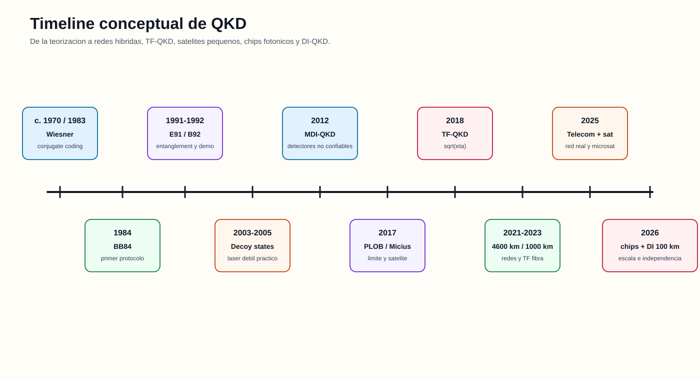
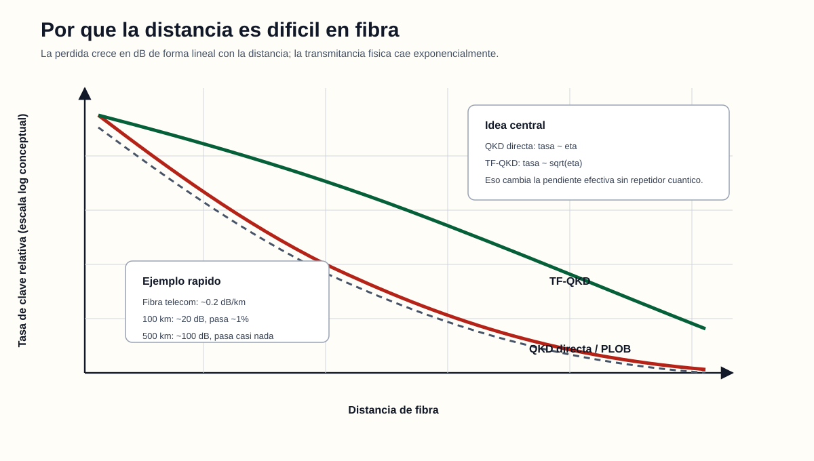
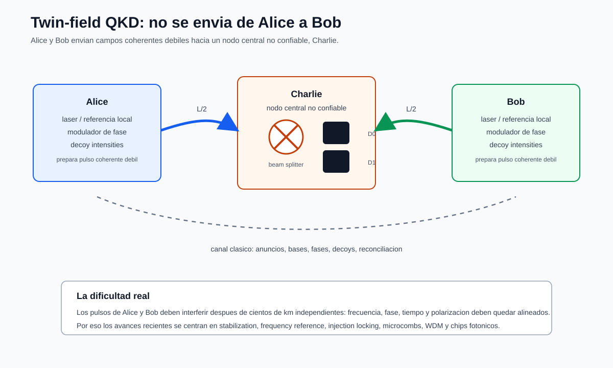
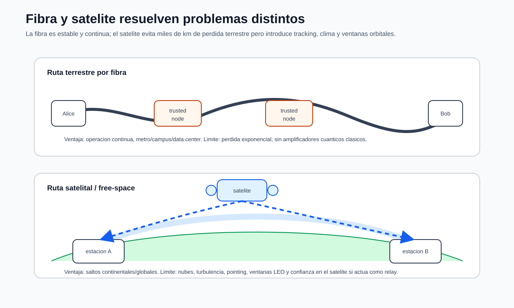

# Frontera QKD 2018-actualidad: TF-QKD, fibra y satélite

Actualización verificada: **14 de julio de 2026**.

## Objetivos

Al terminar deberías poder explicar qué límite motivó TF-QKD, por qué su escala ideal
es distinta de BB84 directo, qué estabilización exige, cómo se diferencia de un
repetidor y por qué fibra y satélite resuelven distancias con compromisos diferentes.



## 1. El muro tasa-distancia

En fibra a 1550 nm, 0,2 dB/km produce:

| Distancia | Pérdida | Transmitancia ideal |
|---:|---:|---:|
| 50 km | 10 dB | `10^-1` |
| 100 km | 20 dB | `10^-2` |
| 200 km | 40 dB | `10^-4` |
| 500 km | 100 dB | `10^-10` |
| 1000 km | 200 dB | `10^-20` |

No sirve amplificar una señal cuántica desconocida como un canal clásico: un
amplificador agrega ruido y no clonación impide copiar perfectamente para regenerar.

El límite PLOB da la capacidad secreta de un canal óptico puro de pérdida sin
repetidores:

```math
K(\eta)\le -\log_2(1-\eta).
```

Para `eta` muy pequeña:

```math
K(\eta)\approx\frac{\eta}{\ln2}\approx1{,}44\eta.
```

La tasa por uso escala linealmente con la transmitancia extremo a extremo. Mejorar
detectores ayuda constantes; no elimina el exponente de distancia.



## 2. Qué existía antes de TF-QKD

### QKD directa

Alice envía hasta Bob. La señal útil atraviesa todo `L`, por lo que escala con
`eta(L)`.

### MDI-QKD

Alice y Bob envían estados a una estación de medición no confiable. Elimina ataques
del detector dentro del modelo MDI, pero la coincidencia de dos señales débiles puede
ser muy costosa en pérdida.

### Repetidores cuánticos

Dividen distancia, distribuyen entrelazamiento, almacenan estados en memorias y hacen
entanglement swapping/purificación. Prometen redes generales, pero requieren memorias
y operaciones aún complejas.

TF-QKD ocupa un punto intermedio: estación central no confiable y escala tipo
repetidor para clave, sin memoria cuántica universal.

## 3. Qué es Twin-field QKD

Lucamarini, Yuan, Dynes y Shields propusieron TF-QKD en 2018. Alice y Bob envían
campos débiles hacia Charlie, situado aproximadamente en el medio. Charlie hace
interferencia de primer orden y anuncia qué detector hizo click.



Una intuición útil es considerar un evento donde la amplitud relevante proviene de
Alice **o** de Bob y los caminos son indistinguibles. El click revela una relación de
fase/paridad, no cuál emisor fue con certeza. El protocolo y los anuncios clásicos
permiten correlacionar bits y acotar a Eve.

No se envía un qubit de Alice a Bob. Ambos contribuyen a una medición central.
Charlie puede ser controlado por Eve; anunciar un click falso o perder eventos queda
incluido en las estadísticas y la prueba correspondiente.

## 4. Por qué puede superar la escala directa

Si la transmitancia total equivalente de una distancia L es `eta`, cada brazo de
longitud aproximada `L/2` tiene transmitancia del orden de:

```math
\eta_{brazo}\sim\sqrt{\eta}.
```

Una detección de interferencia de una sola excitación no exige que dos fotones
independientes sobrevivan simultáneamente todo el trayecto. La tasa ideal puede
escalar como `sqrt(eta)` en vez de `eta`.

Ejemplo conceptual para `eta=10^-10`:

```math
\eta=10^{-10},\qquad\sqrt{\eta}=10^{-5}.
```

Cinco órdenes de magnitud en el exponente son enormes. Las tasas reales incorporan
prefactores, sifting, decoys, error de fase y datos finitos; `sqrt(eta)` no es una tasa
garantizada.

## 5. Cómo se implementa

Una implementación típica necesita:

1. Alice y Bob generan pulsos coherentes débiles.
2. Randomizan/intensifican según signal, decoy y vacío.
3. Codifican bit y fase según la variante TF.
4. Alinean frecuencia, tiempo, polarización y forma de pulso.
5. Envían a Charlie por brazos largos.
6. Charlie combina en un beam splitter y detecta con SNSPD u otro detector de bajo
   ruido.
7. Charlie publica detector y ventana.
8. Alice y Bob publican información de fase/intensidad permitida, tamizan y estiman.
9. Cotas decoy separan contribuciones seguras.
10. Reconciliación y privacidad producen clave final.

Variantes como phase-matching QKD y sending-or-not-sending (SNS) organizan diferente
la codificación y prueba. “TF-QKD” es una familia, no una única receta de laboratorio.

## 6. El problema experimental central: coherencia remota

Para interferir, las señales deben ser indistinguibles cuando llegan a Charlie.

### Frecuencia

Láseres independientes derivan. Una diferencia de frecuencia hace rotar la fase
relativa durante una ventana. Se usan referencias, locking, calibración o referencias
locales.

### Fase de fibra

Temperatura y vibración cambian longitud óptica. En cientos de km, variaciones pequeñas
acumulan fase. Se envían referencias, se estiman bloques y se realimenta.

### Tiempo

Los pulsos deben solaparse por debajo de su ancho/coherencia relevante. Hace falta
sincronización, compensación de retardo y tracking.

### Polarización y espectro

El beam splitter solo produce alto contraste para modos compatibles. Controladores,
filtros y diseño de pulso evitan distinguibilidad.

### Ruido de referencias

Referencias brillantes ayudan a estabilizar pero pueden contaminar detectores por
Raman y scattering. Dual-band stabilization separa canales; referencias locales y
optical injection locking buscan reducir distribución óptica fuerte.

### Datos finitos

La larga distancia produce pocos clicks. Estimar error de fase y yields con confianza
consume datos. Un récord asintótico puede reducirse al exigir seguridad finita y
tiempo operativo real.

## 7. Hitos 2018-2026

### 2018: punto de quiebre

- Boaron et al. demostraron QKD directa segura en 421 km con detectores y control
  extremos.
- Lucamarini et al. propusieron TF-QKD para superar la barrera tasa-distancia sin
  repetidor completo.

### 2019: prueba experimental

Demostraciones de principio mostraron interferencia remota y protocolos tipo TF que
superaban referencias repeaterless en regímenes experimentales. El problema dejó de
ser solo una idea de escalamiento.

### 2020: 509 km con láseres independientes

SNS-TF-QKD sobre 509 km mostró que podía trabajarse con fuentes independientes, un
paso importante frente a configuraciones con una referencia común artificial.

### 2021: 600 km, doble banda y campo interurbano

Dual-band stabilization alcanzó 600 km y un enlace TF de 511 km conectó áreas
metropolitanas. El avance principal fue control de fase/frecuencia en fibra real, no
solo sumar kilómetros de bobina.

### 2022: 830 km

TF-QKD llegó a 830 km de fibra ultrabaja pérdida. A esa distancia, dark counts,
estabilidad y estadística dominan.

### 2023: 1002 km y simplificación de referencias

Se reportó TF-QKD sobre 1002 km. Otros trabajos eliminaron distribución óptica de
frecuencia continua, atacando una barrera de desplegabilidad.

### 2024: referencias locales e integración

TF-QKD con referencia de frecuencia local, injection locking y codificación en chip
redujo dependencia de mesas ópticas y referencias transmitidas por el mismo canal.

### 2025: redes y espacio operacional

- Una red carrier-grade reportó más de 10.000 km, 145 nodos backbone de fibra, seis
  nodos de estaciones terrestres y 20 redes metropolitanas. Usa relays confiables; su
  escala operativa no implica seguridad extremo a extremo sin confianza.
- Microsatélites demostraron QKD en tiempo real con plataformas más pequeñas.
- CV-QKD avanzó en 100 km con tasas altas y análisis composable.

### 2026: chips, DI y throughput

- Una red TF-QKD integrada usó un microcomb central y 20 chips transmisores InP,
  mostrando un camino multiusuario y compacto.
- DI-QKD con átomos individuales reportó tasa asintótica positiva hasta 100 km bajo
  su arquitectura experimental; es una frontera distinta del BB84 óptico de la tesis.
- QKD integrada alcanzó 1,213 Gbit/s de clave secreta en 10 km, mostrando que la
  frontera de tasa metropolitana es distinta de la frontera de distancia TF.

Un récord de 1000 km puede tener tasa operacional pequeña. Un récord gigabit de 10 km
puede ser valioso en datacenter. “Mejor” necesita objetivo, no un único número.

## 8. Fibra frente a satélite



### Fibra

- pérdida exponencial acumulada durante todo el trayecto;
- disponibilidad continua y baja dependencia climática;
- infraestructura enterrada, conectores y coexistencia;
- estabilización crítica en TF-QKD largo;
- enlaces metropolitanos y backbone con nodos confiables.

### Satélite

La mayor parte de la trayectoria ocurre en vacío; la pérdida se concentra en
divergencia geométrica, apuntado, telescopios y atmósfera cerca de tierra. No equivale
a cientos de km de absorción continua en fibra.

Arquitecturas:

- **downlink:** satélite transmite estados a tierra;
- **uplink:** tierra transmite, con turbulencia temprana más problemática;
- **trusted satellite:** comparte claves separadas con estaciones y debe confiarse;
- **entanglement-based:** distribuye pares y puede reducir confianza bajo una prueba
  adecuada, con coincidencias más exigentes.

Desafíos: tracking, ventanas de pase, nubes, turbulencia, fondo diurno, estaciones,
almacenamiento de claves e integración con red terrestre.

| Aspecto | Fibra | Satélite |
|---|---|---|
| Pérdida dominante | absorción/scattering acumulado | geometría, apuntado y atmósfera |
| Disponibilidad | potencialmente continua | pases e impacto meteorológico |
| Infraestructura | ductos, fibra, amplios nodos | telescopios, tracking, segmento espacial |
| Mejor escala | metro/intercity y backbone | continental/global |
| Confianza | endpoints/relays según red | satélite confiable o fuente de entrelazamiento |
| Fondo | canales clásicos/Raman/dark | luz solar, cielo y dark |

La arquitectura global realista es híbrida: fibra local, nodos/red terrestre y enlaces
espaciales para saltos largos.

## 9. Récord, campo, red y producto

| Nivel | Pregunta correcta |
|---|---|
| Prueba de principio | ¿Funciona el mecanismo bajo control? |
| Récord de laboratorio | ¿Qué límite físico/técnico desplazó? |
| Prueba de campo | ¿Tolera fibra desplegada y ambiente? |
| Red | ¿Gestiona múltiples nodos, routing, buffers y O&M? |
| Producto | ¿Tiene operación, interfaces, mantenimiento y evaluación? |

No se debe llamar “red comercial de 1000 km” a una bobina récord ni “internet
cuántica” a cualquier enlace QKD.

## 10. Relación con esta tesis

La tesis usa BB84 time-bin directo en dos nodos. TF-QKD no es una mejora que pueda
activarse cambiando una constante. Exigiría:

- dos transmisores coherentes y una estación central;
- protocolo y prueba diferentes;
- estabilización de fase/frecuencia de dos brazos;
- detección central y posprocesamiento TF;
- nuevos supuestos y métricas.

Su valor para la defensa es ubicar el trabajo: la tesis construye una base de
ingeniería local y pedagógica, mientras la frontera explora distancia, confianza de
medición, integración y tasa.

## 11. Qué debe poder defender Mateo

1. PLOB limita enlaces sin repetidor y escala aproximadamente con `eta`.
2. TF-QKD usa interferencia central y puede escalar como `sqrt(eta)`.
3. Charlie puede ser no confiable, pero fuentes/endpoints siguen teniendo supuestos.
4. TF no es un repetidor cuántico con memoria.
5. La dificultad real es coherencia remota más datos finitos, no solo el protocolo.
6. Fibra y satélite tienen pérdidas y disponibilidad diferentes.
7. Distancia, tasa, integración y confianza son ejes distintos de avance.
8. Ningún hito TF o satelital cambia el protocolo implementado en la tesis.

## 12. Preguntas de tribunal

### ¿Por qué TF supera PLOB si no tiene repetidor?

No viola el bound del mismo canal punto a punto: cambia la arquitectura a dos canales
que terminan en una medición central y usa interferencia monofotónica. La comparación
de tasa-distancia debe hacerse con el modelo de red correcto.

### ¿Por qué no usan TF-QKD en la tesis?

Porque cambia hardware, topología, estabilización, protocolo y prueba. Para un primer
banco de dos nodos, BB84 time-bin permite estudiar los componentes fundamentales con
alcance reproducible. TF es trabajo futuro, no un parámetro adicional.

### ¿Satélite siempre pierde menos?

No para cualquier distancia o condición. Tiene gran pérdida geométrica, tracking,
clima e intermitencia. Su ventaja aparece en escala continental porque evita pérdida
exponencial continua de fibra durante todo el trayecto.

## 13. Fuentes primarias seleccionadas

- S. Pirandola et al., [Fundamental limits of repeaterless quantum communications](https://doi.org/10.1038/ncomms15043), 2017.
- M. Lucamarini et al., [Overcoming the rate-distance limit of quantum key distribution without quantum repeaters](https://doi.org/10.1038/s41586-018-0066-6), 2018.
- A. Boaron et al., [Secure Quantum Key Distribution over 421 km of Optical Fiber](https://doi.org/10.1103/PhysRevLett.121.190502), 2018.
- M. Minder et al., [Experimental quantum key distribution beyond the repeaterless secret key capacity](https://doi.org/10.1038/s41566-019-0377-7), 2019.
- J.-P. Chen et al., [Sending-or-Not-Sending with Independent Lasers over 509 km](https://doi.org/10.1103/PhysRevLett.124.070501), 2020.
- M. Pittaluga et al., [600-km repeater-like quantum communications with dual-band stabilization](https://doi.org/10.1038/s41566-021-00811-0), 2021.
- S. Wang et al., [Twin-field quantum key distribution over 830-km fibre](https://doi.org/10.1038/s41566-021-00928-2), 2022.
- Y. Liu et al., [Experimental Twin-Field QKD over 1000 km Fiber Distance](https://doi.org/10.1103/PhysRevLett.130.210801), 2023.
- J.-P. Chen et al., [Twin-Field QKD with Local Frequency Reference](https://doi.org/10.1103/PhysRevLett.132.260802), 2024.
- Y. Chen et al., [Implementation of carrier-grade quantum communication networks over 10000 km](https://doi.org/10.1038/s41534-025-01089-8), 2025.
- J. Zheng et al., [Large-scale quantum communication networks with integrated photonics](https://doi.org/10.1038/s41586-026-10152-z), 2026.
- Y. Lu et al., [Device-independent quantum key distribution over 100 km with single atoms](https://doi.org/10.1126/science.aec6243), 2026.

## Salida oral de tres minutos

Explicá: pérdida directa, PLOB, dos brazos, interferencia en Charlie, escala
`sqrt(eta)`, estabilización y diferencia con repetidor. Cerrá comparando cuándo elegir
fibra, satélite o una arquitectura híbrida.
